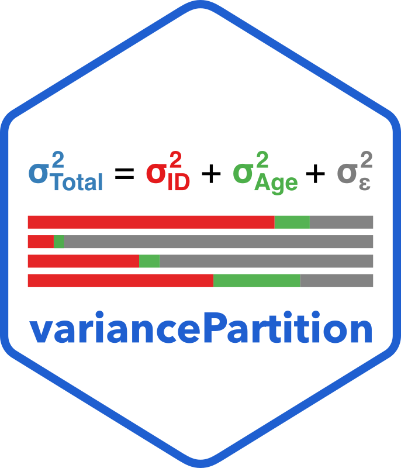
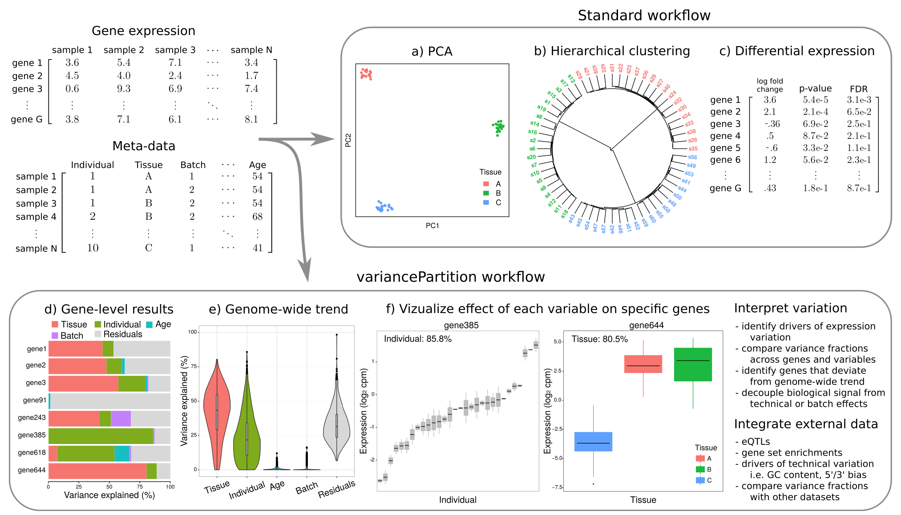

<br>



<div style="text-align: justify">
`variancePartition` quantifies and interprets multiple sources of biological and technical variation in gene expression experiments.  The package a linear mixed model to quantify variation in gene expression attributable to individual, tissue, time point, or technical variables.  The `dream()` function performs differential expression analysis for datasets with repeated measures or high dimensional batch effects.
</div>

<div style="height: 5px;"></div>




### Update
`variancePartition` 2.0.0 includes a new implementation of the core variance partitioning analysis using `fastglmm::varpart()`.  It also supports negative binomial count models from `edgeR` and `DESeq2`.

See [Changelog](news/index.html).  


<br>

### Installation

#### Latest features from GitHub

```r
devtools::install_github("DiseaseNeuroGenomics/variancePartition")
```

#### Stable release from Bioconductor

```r
BiocManager::install("variancePartition")
```


### Notes
This is a developmental version. For stable release see [Bioconductor version](http://bioconductor.org/packages/variancePartition/).

For questions about specifying contrasts with dream, see [examples here](https://gist.github.com/GabrielHoffman/aa993222bae4d6b7d1caea2334aedbf7).


See [frequently asked questions](http://bioconductor.org/packages/devel/bioc/vignettes/variancePartition/inst/doc/FAQ.html).

See repo of [examples from the paper](https://github.com/GabrielHoffman/dream_analysis).

### Reporting bugs

Please help speed up bug fixes by providing a 'minimal reproducible example' that starts with a new R session.  I recommend the [reprex package](https://reprex.tidyverse.org) to produce a GitHub-ready example that is reproducable from a fresh R session.

## References

Describes extensions of `dream` including empirical Bayes moderated t-statistics for linear mixed models and applications to single cell data

- [Hoffman, et al, Nature Communications (2026)](https://doi.org/10.1038/s41467-026-75680-8)

Describes `dream` for differential expression: 

- [Hoffman and Roussos, Bioinformatics (2021)](https://doi.org/10.1093/bioinformatics/btaa687)

Describes the `variancePartition` package:

- [Hoffman and Schadt, BMC Bioinformatics (2016)](https://doi.org/10.1186/s12859-016-1323-z)
