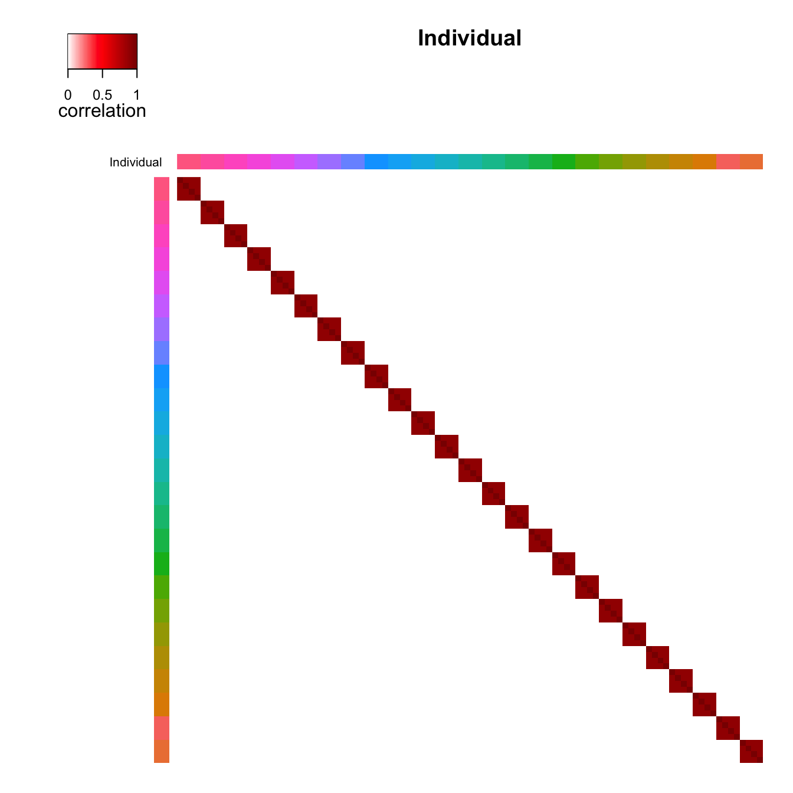
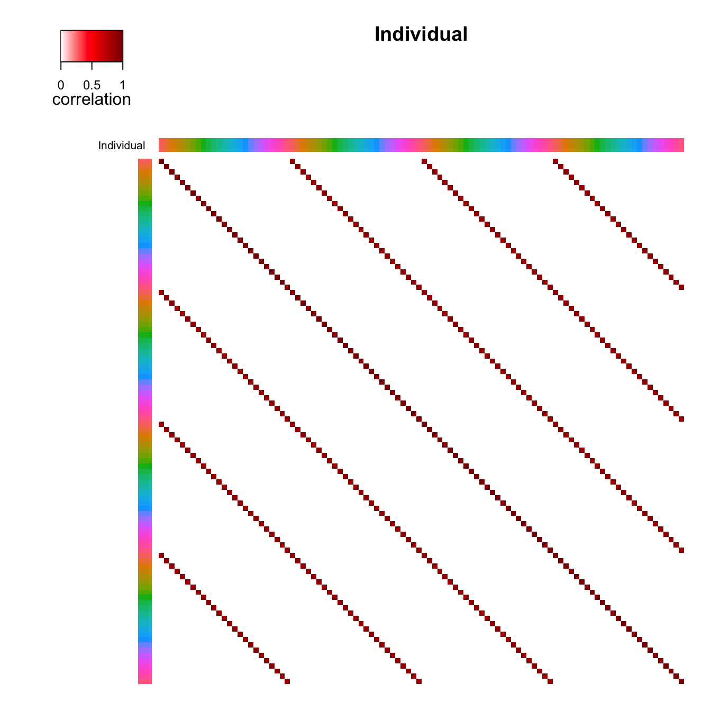
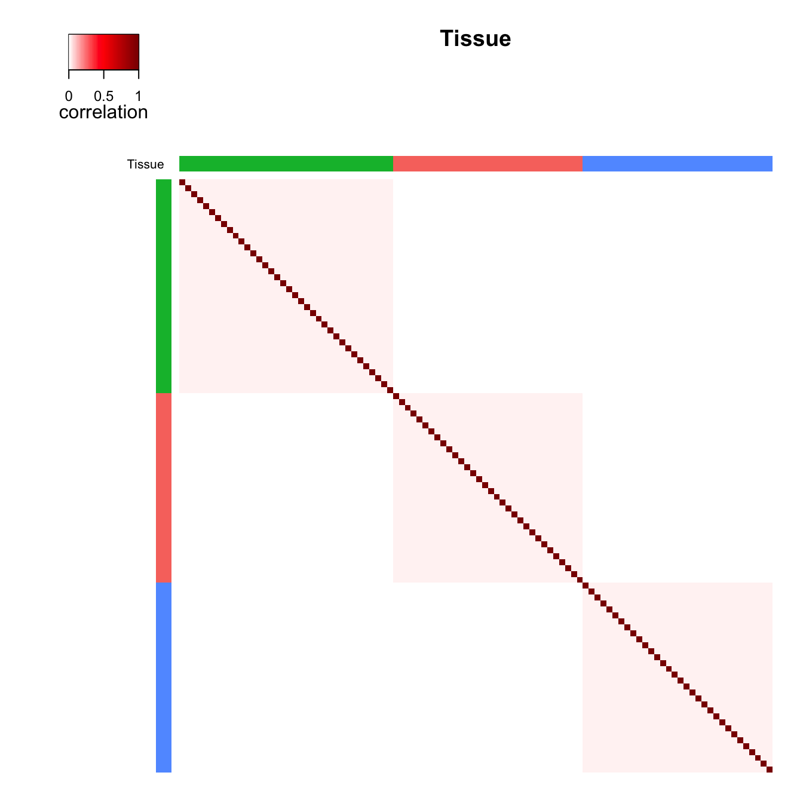
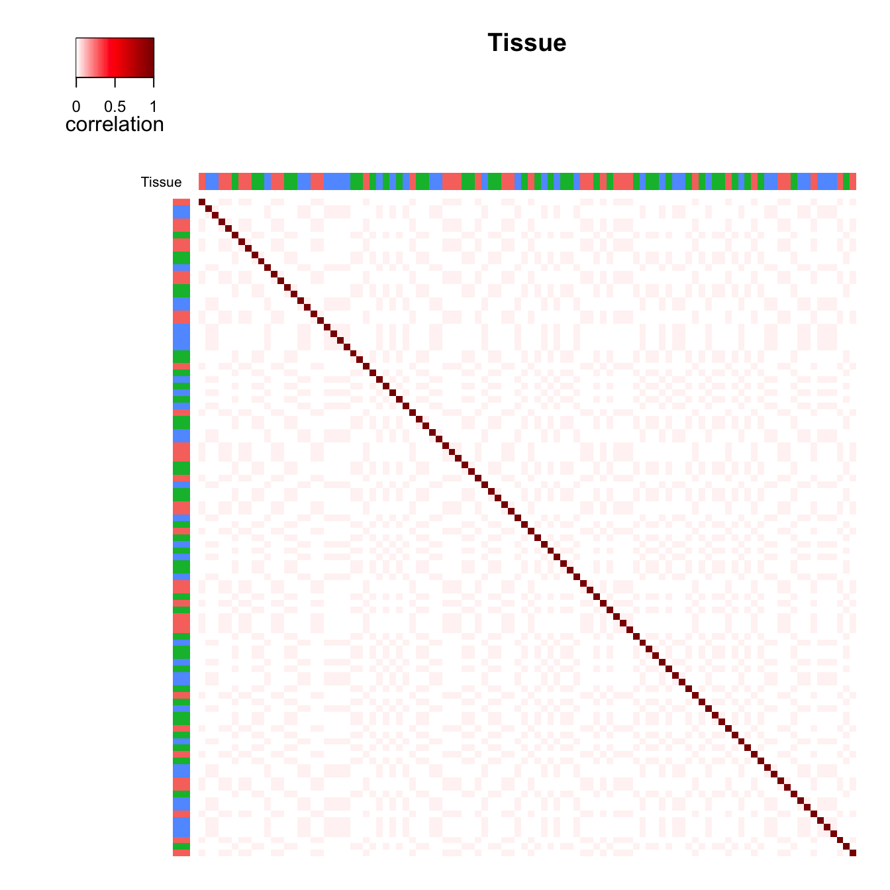
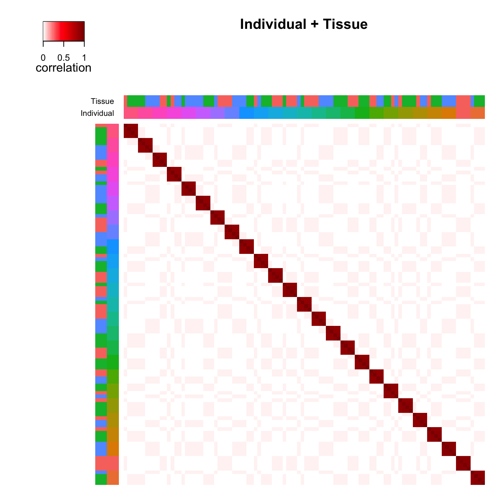
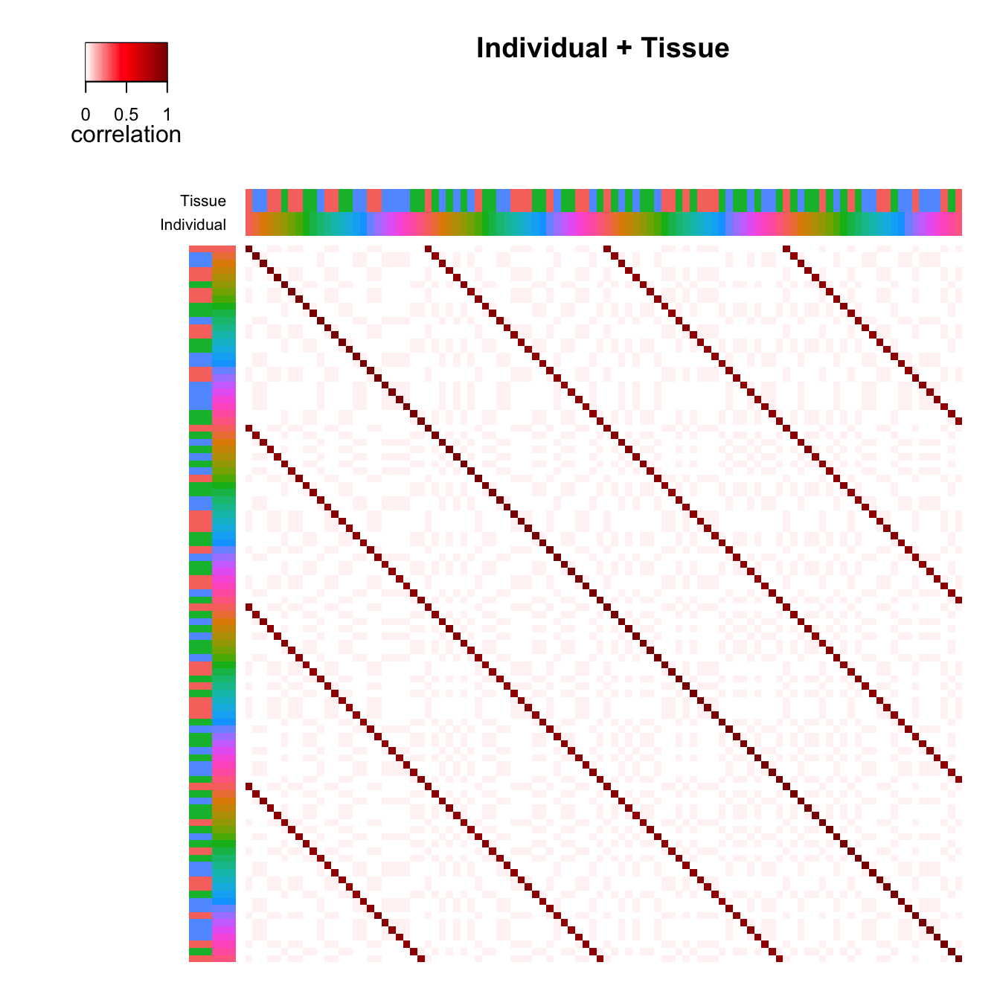

# Additional visualizations of variance structure

The correlation structure between samples in complex study designs can
be decomposed into the contribution of multiple dimensions of variation.
`variancePartition` provides a statistical and visualization framework
to interpret sources of variation. Here I describe a visualization of
the correlation structure between samples for a single gene.

In the example dataset described in the main vignette, samples are
correlated because they can come from the same individual or the same
tissue. The function
[`plotCorrStructure()`](http://DiseaseNeurogenomics.github.io/variancePartition/reference/plotCorrStructure.md)
shows the correlation structure caused by each variable as well and the
joint correlation structure. Figure 1 shows the correlation between
samples from the same individual where (a) shows the samples sorted
based on clustering of the correlation matrix and (b) shows the original
order. Figure 1 c) and d) shows the same type of plot except
demonstrating the effect of tissue. The total correlation structure from
summing individual and tissue correlation matricies is shown in Figure
2. The code to generate these plots is shown below.

## Plot variance structure

`# Fit linear mixed model and examine correlation stucture`` ``# for one gene`` `[`data`](https://rdrr.io/r/utils/data.html)`(``varPartData``)`` `` ``form`` ``<-`` ``~`` ``Age`` ``+`` ``(``1`` ``|`` ``Individual``)`` ``+`` ``(``1`` ``|`` ``Tissue``)`` `` ``fitList`` ``<-`` `[`fitVarPartModel`](http://DiseaseNeurogenomics.github.io/variancePartition/reference/fitVarPartModel-method.md)`(``geneExpr``[``1``:``2``, ``]``, ``form``, ``info``)`` `` ``# focus on one gene`` ``fit`` ``<-`` ``fitList``[[``1``]``]`

### By Individual

#### Reorder samples

`# Figure 1a`` ``# correlation structure based on similarity within Individual`` ``# reorder samples based on clustering`` `[`plotCorrStructure`](http://DiseaseNeurogenomics.github.io/variancePartition/reference/plotCorrStructure.md)`(``fit``, ``"Individual"``)`

#### Original order of samples

`# Figure 1b`` ``# use original order of samples`` `[`plotCorrStructure`](http://DiseaseNeurogenomics.github.io/variancePartition/reference/plotCorrStructure.md)`(``fit``, ``"Individual"``, reorder ``=`` ``FALSE``)`

### By Tissue

#### Reorder samples

`# Figure 1c`` ``# correlation structure based on similarity within Tissue`` ``# reorder samples based on clustering`` `[`plotCorrStructure`](http://DiseaseNeurogenomics.github.io/variancePartition/reference/plotCorrStructure.md)`(``fit``, ``"Tissue"``)`

#### Original order of samples

`# Figure 1d`` ``# use original order of samples`` `[`plotCorrStructure`](http://DiseaseNeurogenomics.github.io/variancePartition/reference/plotCorrStructure.md)`(``fit``, ``"Tissue"``, reorder ``=`` ``FALSE``)`

### By Individual and Tissue

#### Reorder samples

`# Figure 2a`` ``# correlation structure based on similarity within`` ``# Individual *and* Tissue, reorder samples based on clustering`` `[`plotCorrStructure`](http://DiseaseNeurogenomics.github.io/variancePartition/reference/plotCorrStructure.md)`(``fit``)`

#### Original order of samples

`# Figure 2b`` ``# use original order of samples`` `[`plotCorrStructure`](http://DiseaseNeurogenomics.github.io/variancePartition/reference/plotCorrStructure.md)`(``fit``, reorder ``=`` ``FALSE``)`

## Session Info

    ## R version 4.5.1 (2025-06-13)
    ## Platform: aarch64-apple-darwin23.6.0
    ## Running under: macOS Sonoma 14.7.1
    ## 
    ## Matrix products: default
    ## BLAS/LAPACK: /opt/homebrew/Cellar/openblas/0.3.34/lib/libopenblasp-r0.3.34.dylib;  LAPACK version 3.12.0
    ## 
    ## locale:
    ## [1] en_US.UTF-8/en_US.UTF-8/en_US.UTF-8/C/en_US.UTF-8/en_US.UTF-8
    ## 
    ## time zone: America/New_York
    ## tzcode source: internal
    ## 
    ## attached base packages:
    ## [1] stats     graphics  grDevices utils     datasets  methods   base     
    ## 
    ## other attached packages:
    ## [1] variancePartition_2.0.1 BiocParallel_1.44.0     limma_3.66.0           
    ## [4] ggplot2_4.0.3           knitr_1.51             
    ## 
    ## loaded via a namespace (and not attached):
    ##   [1] Rdpack_2.6.6                bitops_1.0-9               
    ##   [3] rlang_1.3.0                 magrittr_2.0.5             
    ##   [5] otel_0.2.0                  matrixStats_1.5.0          
    ##   [7] compiler_4.5.1              mgcv_1.9-4                 
    ##   [9] reshape2_1.4.5              systemfonts_1.3.2          
    ##  [11] vctrs_0.7.3                 stringr_1.6.0              
    ##  [13] pkgconfig_2.0.3             fastmap_1.2.0              
    ##  [15] backports_1.5.1             XVector_0.50.0             
    ##  [17] caTools_1.18.4              rmarkdown_2.31             
    ##  [19] nloptr_2.2.1                ragg_1.5.2                 
    ##  [21] purrr_1.2.2                 xfun_0.60                  
    ##  [23] cachem_1.1.0                jsonlite_2.0.0             
    ##  [25] EnvStats_3.1.0              remaCor_0.0.20             
    ##  [27] DelayedArray_0.36.1         broom_1.0.13               
    ##  [29] parallel_4.5.1              R6_2.6.1                   
    ##  [31] stringi_1.8.7               bslib_0.11.0               
    ##  [33] RColorBrewer_1.1-3          parallelly_1.48.0          
    ##  [35] car_3.1-5                   boot_1.3-32                
    ##  [37] GenomicRanges_1.62.1        jquerylib_0.1.4            
    ##  [39] numDeriv_2016.8-1.1         Rcpp_1.1.2                 
    ##  [41] Seqinfo_1.0.0               SummarizedExperiment_1.40.0
    ##  [43] iterators_1.0.14            IRanges_2.44.0             
    ##  [45] Matrix_1.7-5                splines_4.5.1              
    ##  [47] tidyselect_1.2.1            dichromat_2.0-1            
    ##  [49] abind_1.4-8                 yaml_2.3.12                
    ##  [51] gplots_3.3.0                codetools_0.2-20           
    ##  [53] plyr_1.8.9                  lattice_0.22-9             
    ##  [55] tibble_3.3.1                lmerTest_3.2-1             
    ##  [57] Biobase_2.70.0              withr_3.0.3                
    ##  [59] S7_0.2.2                    evaluate_1.0.5             
    ##  [61] desc_1.4.3                  RcppParallel_6.0.0         
    ##  [63] pillar_1.11.1               MatrixGenerics_1.22.0      
    ##  [65] carData_3.0-6               KernSmooth_2.23-26         
    ##  [67] stats4_4.5.1                reformulas_0.4.4           
    ##  [69] generics_0.1.4              fastglmm_0.4.13            
    ##  [71] S4Vectors_0.48.1            scales_1.4.0               
    ##  [73] aod_1.3.3                   minqa_1.2.8                
    ##  [75] gtools_3.9.5                RhpcBLASctl_0.23-42        
    ##  [77] glue_1.8.1                  tools_4.5.1                
    ##  [79] fANCOVA_0.6-1               lme4_2.1-0                 
    ##  [81] locfit_1.5-9.12             mvtnorm_1.4-2              
    ##  [83] fs_2.1.0                    grid_4.5.1                 
    ##  [85] tidyr_1.3.2                 rbibutils_2.4.1            
    ##  [87] edgeR_4.8.2                 nlme_3.1-170               
    ##  [89] Formula_1.2-5               cli_3.6.6                  
    ##  [91] textshaping_1.0.5           S4Arrays_1.10.1            
    ##  [93] dplyr_1.2.1                 corpcor_1.6.10             
    ##  [95] gtable_0.3.6                DESeq2_1.50.2              
    ##  [97] sass_0.4.10                 digest_0.6.39              
    ##  [99] BiocGenerics_0.56.0         SparseArray_1.10.10        
    ## [101] pbkrtest_0.5.5              htmlwidgets_1.6.4          
    ## [103] farver_2.1.2                htmltools_0.5.9            
    ## [105] pkgdown_2.2.1               lifecycle_1.0.5            
    ## [107] statmod_1.5.2               MASS_7.3-66
