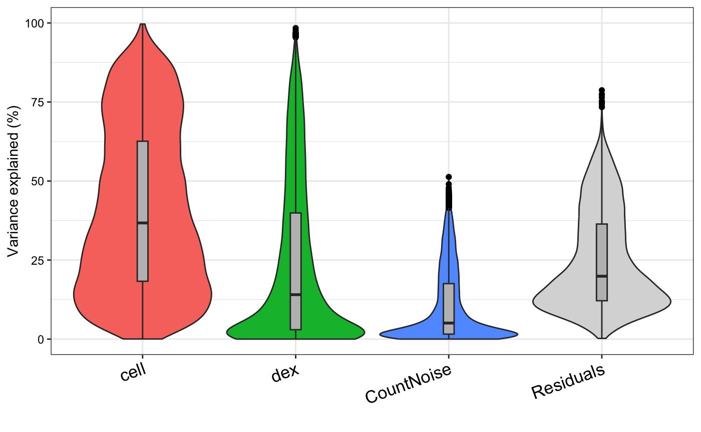
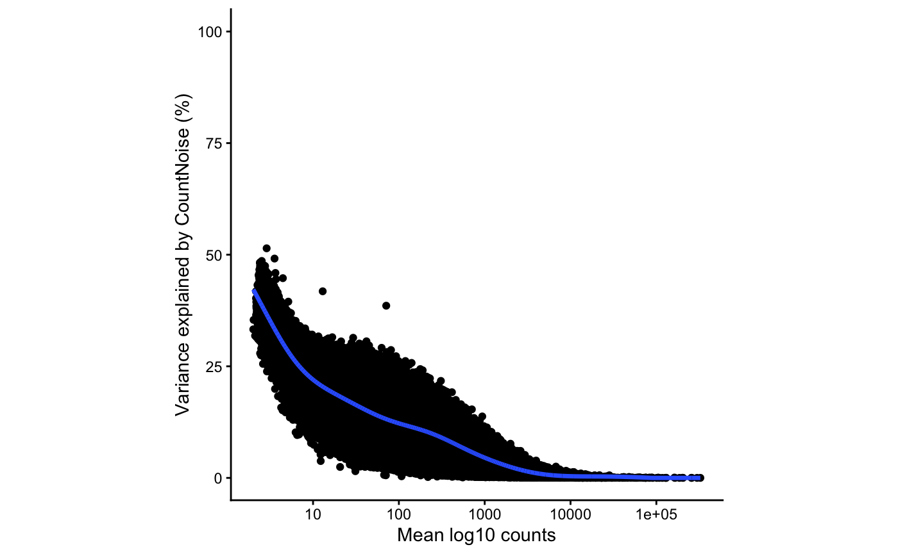
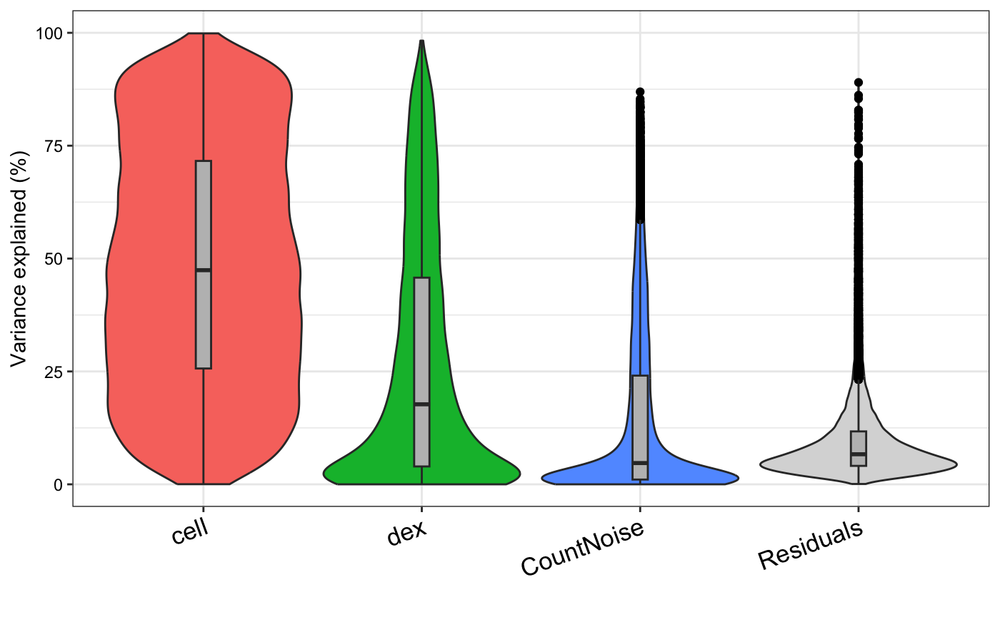
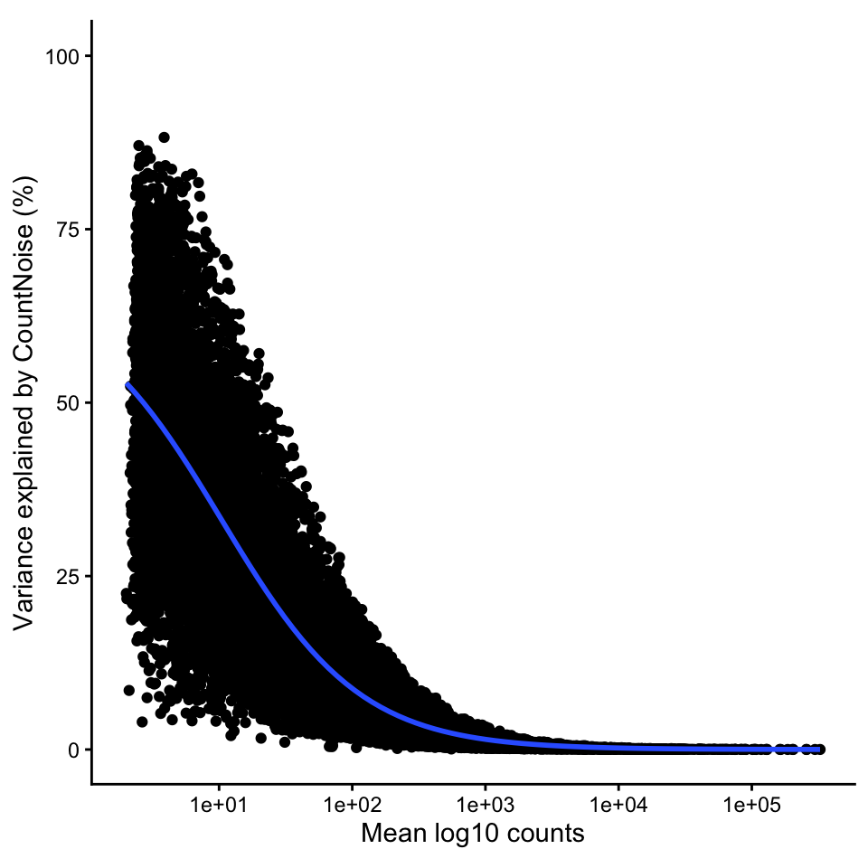

# Variance partitioning for count data

Consider a small example dataset to demonstrate variance partitioning
analysis of count data using results from
[DESeq2](https://bioconductor.org/packages/DESeq2/) or
[edgeR](https://bioconductor.org/packages/edgeR/). Since DEseq2 and
edgeR fit fixed effects negative binomial models, the variance
partitioning analysis for count data only supports fixed effects.

Himes, et al (2014) performed RNA-seq on 4 human airway smooth muscle
cell lines treated with dexamethasone. The dataset is available in the
[airway](https://bioconductor.org/packages/airway/) package. The
variable `cell` indicates the 4 cell lines and `dex` indicates if the
sample was treated with dexamethasone.

Variance partitioning analysis of the count data partitions gene
expression variation into 4 components. These include two biological
sources of variance:

- cell line
- dexamethasone treatment status

Running variance partitioning analysis on a negative binomial count
model allows us to partition the variance not explained by specific
variables into two components:

- count noise due to finite sequencing depth
- residual variance not explained by the model

In this particular dataset, the gene expression variance across cell
lines and dexamethasone treatment status explains most of the variance.
Due to these large bioligical effects, the fraction of gene expression
variance explained by count noise and residuals is small for most genes.
In addition, the fraction of variance explained by count noise decreases
for genes with high read depth. Of course, initial filtering of genes
based on number of counts removes genes with very high count noise here.

Here we show analysis and results with DESeq2 and edgeR. We note that
the packages produce different parameter estimates, especially on small
datasets like this one.

``` r

library(airway)
library(variancePartition)

# Load the example dataset
data("airway")
```

## DESeq2 analysis

``` r

library(DESeq2)

# Set up the DESeq2 design matrix based on the 'dex' (treatment) condition
dds <- DESeqDataSet(airway, design = ~ cell + dex)

# Filter low count
keep <- rowSums(counts(dds)) >= 20
dds <- dds[keep,]

# Run the differential expression analysis
dds <- DESeq(dds)

# Variance partition analysis
vp <- varpart(dds)

# Violin plot of variance fractions
plotVarPart(vp)
```



``` r

# Plot count noise vs expression magnitude
plotTrendVP( dds, vp, "CountNoise" )
```



## edgeR analysis

``` r

library(edgeR)
form = ~ cell + dex
design = model.matrix(form, colData(airway))

countMatrix <- assay(airway, 1)
keep <- rowSums(countMatrix) >= 20

d <- DGEList( countMatrix[keep,] )
d <- normLibSizes(d)
d <- estimateDisp(d, design)

# Fit the NB GLMs with QL methods
fit <- glmQLFit(d, design)
fit <- glmQLFTest(fit)

# Variance partition analysis
vp <- varpart(fit, dispObj = d, formula = form)

# Violin plot of variance fractions
plotVarPart(vp)
```



``` r

# Plot count noise vs expression magnitude
plotTrendVP( dds, vp, "CountNoise" )
```



## Session info

    ## R version 4.5.1 (2025-06-13)
    ## Platform: aarch64-apple-darwin23.6.0
    ## Running under: macOS Sonoma 14.7.1
    ## 
    ## Matrix products: default
    ## BLAS/LAPACK: /opt/homebrew/Cellar/openblas/0.3.33/lib/libopenblasp-r0.3.33.dylib;  LAPACK version 3.12.0
    ## 
    ## locale:
    ## [1] en_US.UTF-8/en_US.UTF-8/en_US.UTF-8/C/en_US.UTF-8/en_US.UTF-8
    ## 
    ## time zone: America/New_York
    ## tzcode source: internal
    ## 
    ## attached base packages:
    ## [1] stats4    stats     graphics  grDevices utils     datasets  methods   base     
    ## 
    ## other attached packages:
    ##  [1] edgeR_4.8.2                 DESeq2_1.50.2               variancePartition_1.43.5   
    ##  [4] BiocParallel_1.44.0         limma_3.66.0                ggplot2_4.0.3              
    ##  [7] airway_1.30.0               SummarizedExperiment_1.40.0 Biobase_2.70.0             
    ## [10] GenomicRanges_1.62.1        Seqinfo_1.0.0               IRanges_2.44.0             
    ## [13] S4Vectors_0.48.1            BiocGenerics_0.56.0         generics_0.1.4             
    ## [16] MatrixGenerics_1.22.0       matrixStats_1.5.0          
    ## 
    ## loaded via a namespace (and not attached):
    ##  [1] Rdpack_2.6.6        bitops_1.0-9        rlang_1.3.0         magrittr_2.0.5     
    ##  [5] otel_0.2.0          compiler_4.5.1      mgcv_1.9-4          reshape2_1.4.5     
    ##  [9] systemfonts_1.3.2   vctrs_0.7.3         stringr_1.6.0       pkgconfig_2.0.3    
    ## [13] fastmap_1.2.0       backports_1.5.1     XVector_0.50.0      labeling_0.4.3     
    ## [17] caTools_1.18.3      rmarkdown_2.31      nloptr_2.2.1        ragg_1.5.2         
    ## [21] purrr_1.2.2         xfun_0.59           cachem_1.1.0        jsonlite_2.0.0     
    ## [25] EnvStats_3.1.0      remaCor_0.0.20      DelayedArray_0.36.1 broom_1.0.13       
    ## [29] parallel_4.5.1      R6_2.6.1            stringi_1.8.7       bslib_0.11.0       
    ## [33] RColorBrewer_1.1-3  parallelly_1.48.0   car_3.1-5           boot_1.3-32        
    ## [37] jquerylib_0.1.4     numDeriv_2016.8-1.1 Rcpp_1.1.2          iterators_1.0.14   
    ## [41] knitr_1.51          Matrix_1.7-5        splines_4.5.1       tidyselect_1.2.1   
    ## [45] dichromat_2.0-0.1   abind_1.4-8         yaml_2.3.12         gplots_3.3.0       
    ## [49] codetools_0.2-20    plyr_1.8.9          lattice_0.22-9      tibble_3.3.1       
    ## [53] lmerTest_3.2-1      withr_3.0.3         S7_0.2.2            evaluate_1.0.5     
    ## [57] desc_1.4.3          pillar_1.11.1       carData_3.0-6       KernSmooth_2.23-26 
    ## [61] reformulas_0.4.4    fastglmm_0.4.10     scales_1.4.0        aod_1.3.3          
    ## [65] minqa_1.2.8         gtools_3.9.5        RhpcBLASctl_0.23-42 glue_1.8.1         
    ## [69] tools_4.5.1         fANCOVA_0.6-1       lme4_2.0-1          locfit_1.5-9.12    
    ## [73] mvtnorm_1.4-1       fs_2.1.0            grid_4.5.1          tidyr_1.3.2        
    ## [77] rbibutils_2.4.1     nlme_3.1-169        Formula_1.2-5       cli_3.6.6          
    ## [81] textshaping_1.0.5   S4Arrays_1.10.1     dplyr_1.2.1         corpcor_1.6.10     
    ## [85] gtable_0.3.6        sass_0.4.10         digest_0.6.39       SparseArray_1.10.10
    ## [89] pbkrtest_0.5.5      htmlwidgets_1.6.4   farver_2.1.2        htmltools_0.5.9    
    ## [93] pkgdown_2.2.1       lifecycle_1.0.5     statmod_1.5.2       MASS_7.3-65

\<\>

## References

Himes, E. B, et al. (2014). “RNA-Seq Transcriptome Profiling Identifies
CRISPLD2 as a Glucocorticoid Responsive Gene that Modulates Cytokine
Function in Airway Smooth Muscle Cells.” PLoS ONE, 9(6), e99625.
<https://doi.org/10.1371/journal.pone.0099625>
